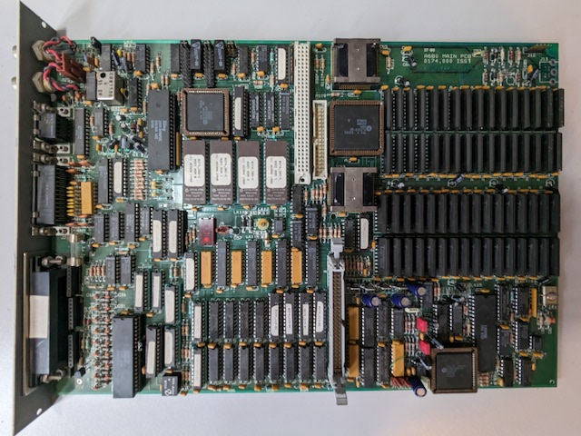

# Acorn A680

Roughly 20 years ago, when I was involved in the Cambridge University
Computer Preservation Society, I was given three
[A680](https://www.computinghistory.org.uk/det/16155/Acorn-A680/) main
boards by an ex-Acorn employee.

I've not done much with them, and thought I should document these
boards a little! The machine itself is pretty well-documented on
[Chris's
Acorns](http://chrisacorns.computinghistory.org.uk/RISCiXComputers.html#A680).

As the A680 was a prototype-only machine, I'm not entirely sure if
these boards ever had a case - they've got a little plastic foot on
the back to allow them to rest on a surface without being mounted in a
case.

They're quite clearly prototype-y - they've all got bodge wires on
them, pretty much everything's socketed, EPROMs for ROMs, etc. One of
them has a little daughterboard to adapt the surface-mount CPU to the
socket, and one of them is missing the CPU. It looks like the internal
model number is 0174 or 0274 (I don't know much about Acorn model
numbers).

Photos [here](./photos)!

## Schematics

Chris's Acorns contains [some
schematics](http://chrisacorns.computinghistory.org.uk/docs/Acorn/Manuals/Acorn_A680TRM_Drawings.zip)
as part of the official documentation, but I managed to get another
copy via a different route:

Back when I first got the boards, I mentioned this to another CUCPS
person, and they told me they could get me schematics, which might be
useful if I were to play about with the boards... and they did! It
appears they came from a different source, because they have different
engineering metadata stuff around the edge of the schematics, which is
kind of interesting, but I suspect the schematics from the above link
will be better for most users.

I have scanned (and reassembled the dodgy photocopying)
[here](./schematics).

## ROMs

The [roms](./roms) directory contains the 4 EPROM images that each
provide a byte of the 32-bit data the CPU needs. The `a680.bin` file
interleaves the ROMs to produce the image seen by the processor. The
ROMs contain little-endian ARM code, which I've done a little
reversing of in Ghidra.

The EPROMs are half-empty, having 256kB of contents in 512kB total
EPROMs (4x128kB). They are labelled "0274,20[0-3]-C BOOT ROM [0-3] (C)
ACORN 1988".

TODO: Cross-checking contents.

TODO: Reverse a bit more and include the basics of the analysis.

## GALs/PALs

TODO: The board has 16 GALs on it. I have yet to try dumping them, and
don't know if they're protected.

## Misc technical details

[Chris's
Acorns](http://chrisacorns.computinghistory.org.uk/RISCiXComputers.html#A680)
includes the Technical Reference Manuals, which are pretty good for
technical details.

Data sheets for the Acorn custom ICs are available on
[BitSavers](http://www.bitsavers.org/pdf/acorn/).

It looks like the -5V rail is *only* used to pass through the -5V
supply to the backplane.

TODO: Board-powering options?
